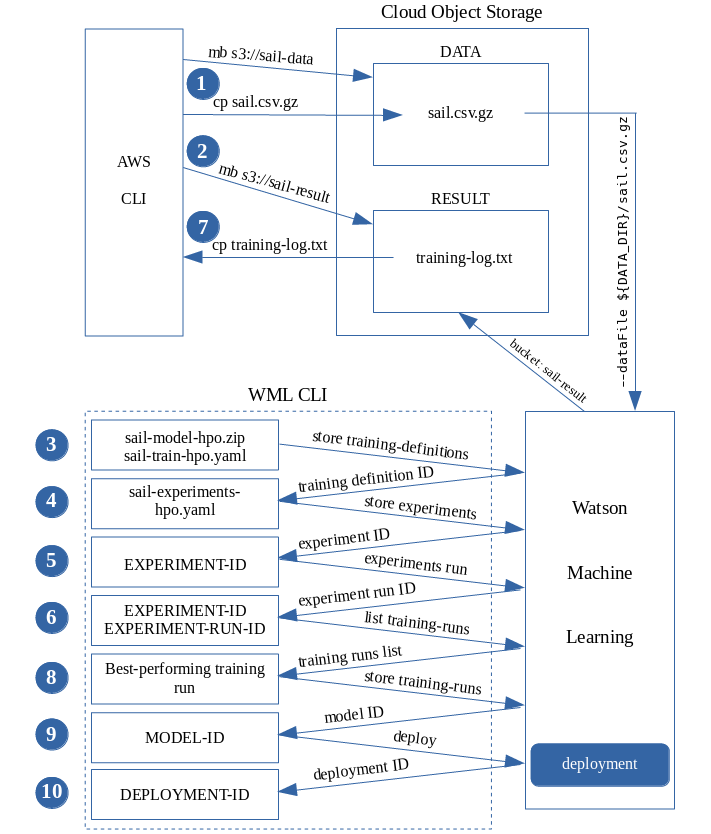

# Sail
Damage from sea disaster is no less than a wildfire. No ship owner has enough money to compensate for marine pollution caused by their ship, so they all have to buy P&I insurance. A crude oil tanker can have a deadweight of up to 550 thousand metric tons. If it sank then it was a terrible disaster.

Sail solution is a machine learning application that uses the IBM Cloud platform. This is a deep learning program with hyperparameter optimization experiment. The neural network is trained and deployed through IBM Watson Machine Learning CLI commands. The client program runs on a notebook to predict the risk, sending the payload data to the trained model via a Python function. This function is a Python closure that performs two tasks:
- Convert raw input data from users as human-readable strings to model deployment payload format.
- Convert the classification index data that is returned by the model to human-readable text that describes the level of risk.

Model data is a .csv file with 3000 examples, of which 2700 examples are for training and 300 examples are for testing. The experiment trains 4 training runs simultaneously and the model of the best-performing training run achieves test accuracy of over 98%.

The risk depends mainly on the weather. When predicting, the weather factor is taken from the IBM Business Weather Channel via API key. The other 11 elements are flag, ship type, deadweight, shipbuilding year, crew nationality, cargo, sailing area, season, number of sailing days, bill of lading quality and PSC safety inspection status (PSC - [Port State Control](http://www.imo.org/en/OurWork/MSAS/Pages/PortStateControl.aspx)).

**NEW!** Weather data collected from the Weather Channel in raw form can be processed to classify using FUZZY programming language. In this solution, Fuzzy proved to be a competitor to Neural Network. While Neural Network find the rules in the sample, Fuzzy performs fuzzy inferences based on the rules of [human] experts. Because the rules that give Fuzzy are just general rules, it won't make mistakes.

All 12 factors affect maritime risks. There are 20 types of cargoes in the example set. Cargoes such as steel coils, heavy-lift, equipment, grain in bulk, log wood, petroleum products, chemicals are dangerous for ships than other types. But their level of danger depends on other factors. For example, for steel coils, on Japanese ships with Japanese crew, because these crew members are highly responsible, the goods are securely lashed, not moved and therefore do not cause lossing safety. New ships are usually safer than old ones. The longer the sailing time, the higher the risk. Traditional risk analysis systems usually consider 5-days, 10-days periods to mark a new level of risk. Interestingly, the Sail solution accepts calculations for any number of days. Bill of lading quality is also an important factor, but they are usually only meaningful for flagged vessels of underdeveloped countries. The ship owners are not interested in or accepting transport contracts but reducing the expense of dunnage thus causing a high risk of sinking.

The Sail solution can be applied to calculate maritime risks in general, to use for maritime accident investigation agencies, can be applied for maritime risk calculations to insurance sellers and other cases such as used as a reference factor in freight calculation.

Sail solution uses Watson Machine Learning CLI to build and deploy model in Watson Machine Learning (WML) with tensorflow 1.5 framework running on Python 3.5, use AWS CLI to create buckets and to upload, download files in Cloud Object Storage, use a notebook to implement risk classification, and get weather data from the IBM Business Weather Channel.

The Sail solution diagram is divided into four functional blocks: experiment, deployable function, notebook, Weather Channel data.

## 1) experiment

 Experiment block performs model training with hyperparameters optimization and model deployment. It has 3 files to request WML service and a sample data file:
 
   - **sail-model-hpo.zip**: Model building code, which is a zip file containing two source files sail_network.py and input_data.py
    
   - **sail-train-hpo.yaml**: The training run manifest contains metadata showing how to execute model building code
    
   - **sail-experiments-hpo.yaml**: The experiment manifest contains metadata that configures optimized hyperparameters in multiple training runs
    
   - **sail.csv.gz**: Sample data file containing 3000 examples, of which 2700 examples are used for training and 300 examples are for testing

AWS CLI is used to create sail-data bucket to store sample data and sail-result bucket to store training results that we will get a log file from there. Data file sail.csv.gz is uploaded to bucket sail-data.

After data has been prepared in Cloud Object Storage, WML CLI is used to define training run with two files sail-model-hpo.zip and sail-train-hpo.yaml. The returned result contains TRAINING-DEFINITION-ID used to update sail-experiments-hpo.yaml manifest file. The experiment is then stored with this file. EXPERIMENT-ID returned is used to run experiment. The result returned contains EXPERIMENT-RUN-ID. In this process we can run the command 'bx ml list training-runs EXPERIMENT-ID EXPERIMENT-RUN-ID' to see the training status of the training runs. When the training is completed, AWS CLI is used to download the log file training-log.txt to see and select the model of the best-performing training run. We store the model in the WML repository and deploy this model. The construction and deployment of the model is shown in the following diagram:



## 2) deployable function

The deployable function is a Python closure placed in the deploy_function.py file. The point of interest is that when converting the data received from the client application to the deployment model payload format, it takes two steps:
- Convert strings to numbers through a dictionary, and leave other inputs intact if they are not strings but inherently numbers
- Calculates the payload value for each column based on the max and min values of each column in the sample data that transmit to the function as default arguments, according to the following formula:

  *payload_value = (orig_value - min_value) / (max_value - min_value)*

  Where: orig_value is the unconverted value. max_value, min_value are the maximum and minimum values of the corresponding column.
  This ensures that the payload values are independent on each column and are fully distributed in the mathematical range [0.0, 1.0], although the original data of the columns is very different and the original values of some columns can focus very far from point 0 (like year numbers). Since then different values are good distinguished.

The function deployment can be performed on a local machine. The model_endpoint_url variable in the source code will be assigned the value Scoring endpoint of the model deployment above.

## 3) notebook and Weather Channel data

The notebook sends predictive data to the model via the function deployment, and get results. The method used is REST API. The source code is in file notebook.py. The weather is taken for 7 days. When scoring, users only need to enter 11 other factors, while the weather factor is entered automatically. The point of interest is that weather data from the Weather Channel needs to be converted to weather classes. This can be thought of as a classification subprogram, using Python code for a recursive function with a schema in the form of a dictionary:

```python
def lookup(schema, input_values):
    label = schema['label']
    if label is None:
        return schema['value']
    else:
        input_value = input_values[label]
        child = schema['values'][input_value]
        return lookup(child, input_values)
```

**NEW!** A new method for weather data preprocessing is using FUZZY programming language. The Python source code is in notebook_fuzzy.py file instead of notebook.py. FUZZY source code is file wea_fuzzy.c.

The fuzzy rules are applied as follows:
```c
rule max_temp.heat OR min_temp.freeze => score.dangerous;
rule storm.strong OR wind.gale => score.dangerous;
rule wind.strong OR storm.light => score.bad;
rule wind.moderate AND thunder.yes => score.bad;
rule VERY fog.yes => score.bad;
rule (max_temp.hot OR min_temp.cold) AND storm.none AND wind.moderate AND
    thunder.no AND fog.no => score.normal;
rule LITTLE max_temp.mild AND LITTLE min_temp.mild AND REALLY storm.none AND
    (wind.breeze OR wind.calm) AND thunder.no AND fog.no => score.good;
```
The defuzzification is implemented by defuzz_score() function:
```c
int defuzz_score() {
    int num_score = 4;
    FuzzyPair array_all[num_score];
    FuzzyToArray(score, array_all);
    int index_max_first = 0;
    Number max_grade = 0;
    for(int i = 0; i < num_score; i++)
        if (array_all[i].m_grade > max_grade) {
            max_grade = array_all[i].m_grade;
            index_max_first = i;
        }
    Number array_max[num_score];
    int count_max = 0;
    for(int i = index_max_first; i < num_score; i++)
        if (array_all[i].m_grade == max_grade) {
            array_max[count_max] = array_all[i].m_value;
            count_max++;
        }
    int value_max_average = floor( (array_max[0] + array_max[count_max - 1]) / 2 );
    return value_max_average;
}
```

In notebook_fuzzy.py, the input data is given to the fuzzy program as its command line argument, using the -r option:
```python
arg = " ".join([str(max_temp), str(min_temp), str(storm),
                str(wind), str(thunder), str(fog)])

try:
    out = run(["./fuzzy", "-r", arg, "wea_fuzzy.c"], stdout=PIPE, stderr=STDOUT, check=True)
    return out.stdout.decode()[:-1]
    
except CalledProcessError as error:
    print (error.stdout.decode()[:-1])
    return ''
```
The use of Fuzzy has the following advantages:

- Weather data is only a forecast, not sure, so it is suitable for fuzzy sets
- It is possible to receive input data directly from a data range without dividing data by hierarchy. That will bring enough information. For example, if the wind forecast is "... wind from 30 to 50 ...", it will match the fuzzy set (..., 0.5/30, 1/40, 0.5/50, ...)
- The rules are simple and explicit

The code for weather data preprocessing is placed in the same file with the notebook. However, to emphasize the weather feature, it is separated into a separate block.

Overview diagram of the Sail solution is as follows:


## Valid input values

When predicting, the input values ​​must be entered. Below is lists of valid input values ​​corresponding to each column in the sample data table

**FLAG**
```python
"US"
"Japan"
"Panama"
"Vietnam"
```
**TYPE OF SHIP**
```python
"General Cargo"
"Bulk Carriers"
"Container"
"Ro-Ro"
"Oil Tanker"
"Liquefied Gas"
"Chemical Carriers"
```
**DWT (DEADWEIGHT)**
```python
Should be a number in the range from 7000 to 550000
```
**BUILD**
```python
Should be a number in the range from 2005 to 2019
```
**CITIZEN**
```python
"American"
"Japanese"
"Korean"
"Chinese"
"Philippines"
"Vietnamese"
"Multi-national"
```
**CARGO**
```python
"Rice in bags"
"Soybean milk"
"Tapioca chip"
"Grain in bulk"
"Coal"
"Cement"
"Clay"
"Ore in bulk"
"Ore in jumbo bag"
"Timber"
"Logs"
"Cars"
"Equipment"
"Steel products"
"Heavy-lift"
"Containers"
"Product oil"
"Crude oil"
"Chemical"
"Gas"
```
**AREA**
```python
"Pacific"
"Indian Ocean"
"Atlantic"
"Indonesia Sea"
"Yellow Sea"
"Mediterranean"
```
**SEASON**
```python
"Summer"
"Winter"
```
**WEATHER**

This factor is entered automatically

**PERIOD**
```python
Should be a number in the range from 5 to 40
```
**B.O.L**
```python
"Good"
"Normal"
"Bad"
```
**PSC**
```python
"Good"
"Normal"
"Bad"
```

## Results classes
The result will be one of five classes:
```python
"Safe"
"Low Risk"
"Medium Risk"
"High Risk"
"Dangerous"
```
